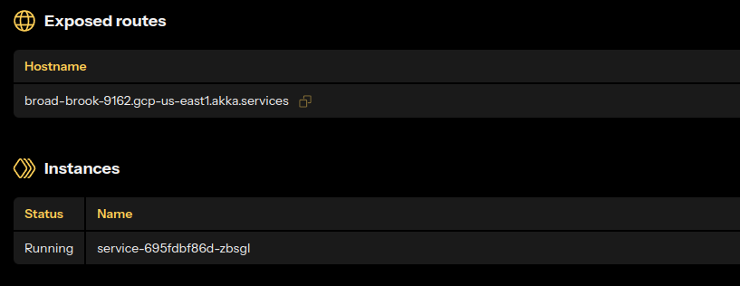

Like all Akka services, the **Akka Cache** service is flexible in how it can be deployed. In this guide, you'll go through the steps to deploy it into your own [akka.io](https://akka.io) account. In order to continue, you'll want to make sure that you've set up all of the [pre-requisites](./prerequisites.md), including creating an Akka account.

## Deciding on a Container Image
When you deploy a service to Akka, you need to know the URL of that image within a [container registry](https://doc.akka.io/operations/projects/container-registries.html). For this guide we'll use a publicly available image to get the cache service deployed as quickly and easily as possible.

We'll start with an image that allows the public internet to access the cache API, which is _not_ recommended for production use but makes it easy to experiment with. You can find this image at the following docker hub URL:

```
https://(TBD)/(TBD):insecure
```
## Create or Reuse a Project
Every service deployed on the Akka platform exists within a **project**. You can either create a new one or select a pre-existing one. You'll need to use the `akka` CLI to choose the target project for your deployments. For example, to select a project named cache, you would enter the following command at a terminal prompt:

```
akka config set project cache
```

Make sure the project name matches exactly what you see in the output of `akka projects list`


## Deploy the Service
Now that your Akka CLI is configured to point to your desired target project and organization, you're ready to deploy. Deploying a service is done with just one easy command:

```
akka service deploy akka-cache {registry-url}/{repo}:{tag}
```

Here, `registry-url` should be something like `hub.docker.com`, `ghcr.io`, or any other container registry you're using. Note that if the registry requires authentication, you'll need to configure that via the [akka CLI](https://doc.akka.io/operations/projects/container-registries.html)

If all goes well, you should see a message indicating that the service has been created:

```
Deployment of service 'akka-cache' initiated, check its status with `akka services list`
```

If you have a browser tab opened to the services list in your Akka project view, you'll immediately see a new box for the Akka cache service appear. A moment later, you'll see the realtime status of that service become _available_. 

## Exposing your Cache Service
At this point you've got a service deployed and running in your project, but clients outside the Akka infrastructure cannot connect to it. To make your service available to the Internet, simply click the ellipsis at the top of the service box and select _expose_. This will prompt you for a few options and then you'll be shown the public host name for this service. 

You now have a public-facing host name ready to serve requests for all of the HTTP endpoints in your service. Clicking on the service to get more details will show you this host name:



Remember that if you've been following this guide, you're currently using an _unsecure_ service. We'll go through some steps on securing this in the next section. For now, let's move on to playing with the cache.

## Create a Cache Value
Let's use the API to create a new cache value. While there are client SDKs available for multiple programming languages, `curl` is still the quickest path to exercising the service.

Store a new value in a cache (replace the host name below with yours):

``` 
curl -H "Content-Type: application/json" -X POST https://broad-brook-9162.gcp-us-east1.akka.services/cache/set -d '{"cacheName": "democache", "key": "docs", "value": "aGVsbG8gd29ybGQ="}'
``` 

Note that the value in this case is a base-64-encoded version of the actual data. You can now go into the component view for the `CacheEntity` component and find the current state of that entity or you can use `curl` to obtain that value directly.


```
curl -H "Content-Type: application/json" https://broad-brook-9162.gcp-us-east1.akka.services/cache/democache/docs
hello world
```

You're ready to go! You now have a completely managed, resilient, replicated cache that you were able to deploy into your account without writing a single line of code. Next we'll go through the process of using the production version of Akka Cache and setting up secrets and JWTs to secure it.

